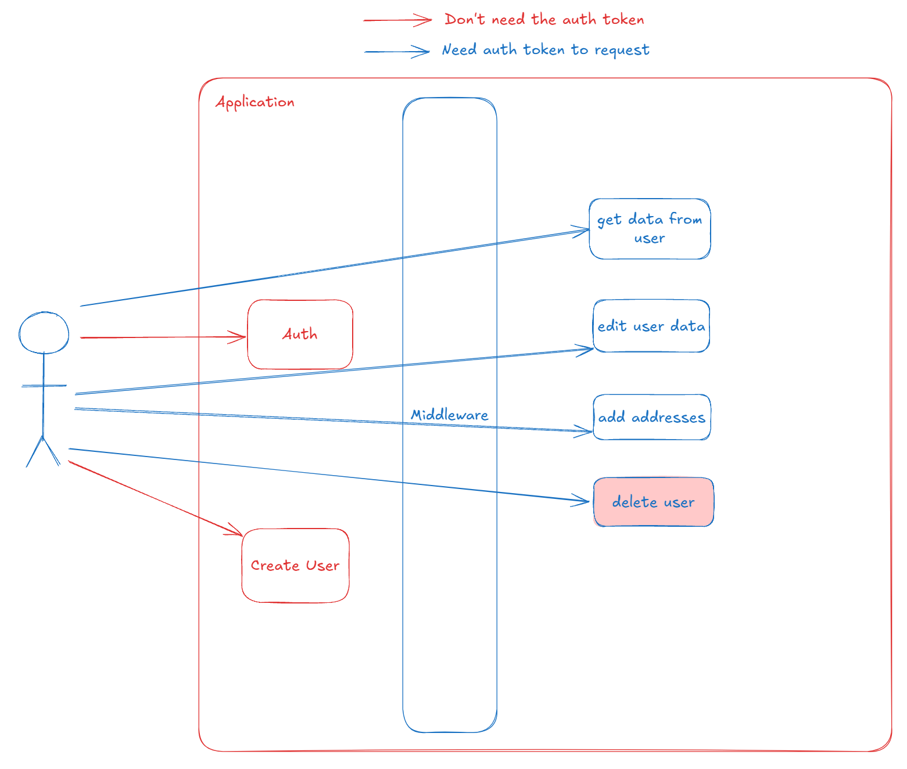

# User JWT Management




## Objetivo

* Sistema que realiza o cadastro de usuários, realiza a autenticação usando JWT e permite a manipulação de dados do usuário quando o token de autenticação é passado via cabeçalho. Projeto desenvolvido em PHP + Laravel + MySQL + Docker. Foram aplicadas praticas de TDD + clean architecture, deixando o sistema mais robusto a mudanças de tecnologias e protegendo o domínio da aplicação.

### Ajustes e melhorias

* Projeto foi desenvolvido em PHP 8, podendo ser um impeditivo para a execução do mesmo em algumas versões mais antigas;
* Incluir a pasta vendor no repositório não é uma boa prática, mas foi inclusa apenas para facilitar a execução do projeto;

## 💻 Pré-requisitos

Antes de começar, verifique se você atendeu aos seguintes requisitos:

- Você precisa do software `docker` na sua máquina para realizar a criação dos containers de aplicação e banco de dados.

## ☕ Usando o User JWT Management

Para usar User JWT Management, siga estas etapas:

```
<!-- Na raíz do projeto, execute -->
docker-compose up --build
```

Esse comando irá subir todos os nossos containers docker e irão inicializar de acordo com o configurado no `Dockerfile` e `docker-compose.yml`.

## Testes

Para facilitar a execução dos testes, criamos 2 maneiras de fazer isso.

* Testes automatizados: O projeto deve estar executando normalmente com o comando `docker-compose up --build` e podemos utilizar o script escrito em bash `test_script.sh` para executar os testes automatizados. Esse script acaba entrando dentro do container da aplicação, realiza o comando `php artisan test` e retorna o resultado no cmd do usuário.
* Teste manuais: Temos disponibilizado uma collection do [POSTMAN](./tests/Postman/UserJWTManagement.postman_collection) onde você pode realizar os testes rota por rota. Também é necessário que o projeto esteja sendo executado normalmente com o docker.

## Informações adicionais

* Todas as informações salvas no banco de dados serão persistidas na pasta `docker/db`.
* Ao inicializar o projeto laravel, ele já realiza a execução do `php artisan migrate` então o projeto já estará com as migrations atualizadas.